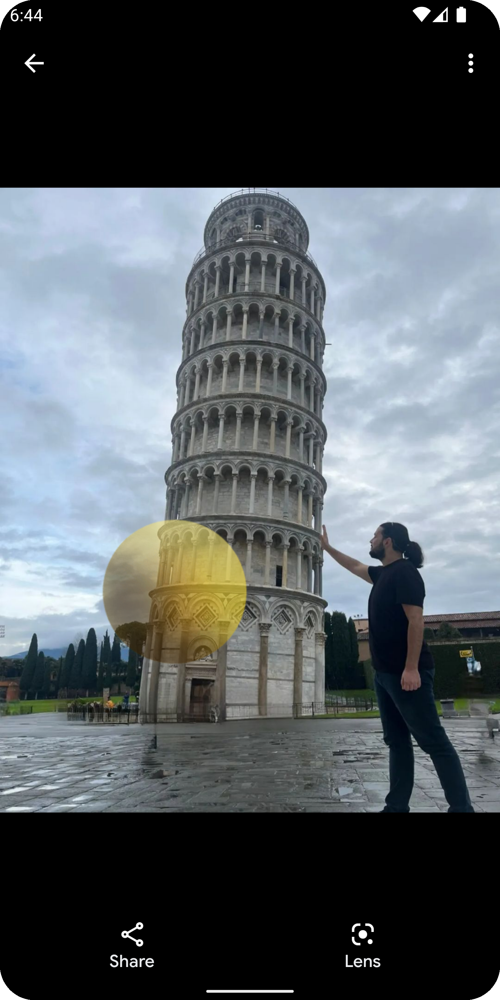

# PhotoFilterApp
 
## Development Environment
- Android Studio: Dolphin or Higher
- Language: Kotlin
- Build System: Gradle

## Features
- Clean Architecture + Model View Model Model Pattern + Repository Pattern.
- Jetpack Libraries and Architecture Component
- Refrofit2, OKHTTP3 and Gson
- RxJava2
- Offline Persistence (Room Database)
- Coil
- CustomView, Recyclerview
- Lifecycle
- Navigation Component
- File operations (Save image)
- Rotation Support
- Github for CI

## Libraries
   * Data Binding
   * Live Data
   * Navigation
   * Dagger2
   * Rxjava2
   * Room
   * Coil
   * Refrofit2
   * OKHTTP3
   * Lifecycle

## Other Features
* Custom view that draws given bitmap and selected overlay bitmap.
* Custom view extend View class.   
* Drag overlay bitmap with one finger touch. Used GestureDetector.SimpleOnGestureListener
* Implement pinch zoom to overlay bitmap. Used ScaleGestureDetector.SimpleOnScaleGestureListener
* Save Image. When click to the save icon, Save drawn bitmap as JPG to the external.

## Demo
<table>
  <tr>
     <td>User Interface</td>
     <td>CustomView/Recyclerview</td>
     <td>Drag Overlay</td>
  </tr>
  <tr>
    <td style="width:270px;height:480px"></td>
    <td style="width:270px;height:480px"></td>
    <td style="width:270px;height:480px"></td>
  </tr>
   <tr>
     <td>Pinch Zoom</td>
     <td>Save Image</td>
     <td></td>
  </tr>
   <tr>
    <td style="width:270px;height:480px"></td>
    <td style="width:270px;height:480px"></td>
    <td style="width:270px;height:480px"></td>
  </tr>
 </table>

